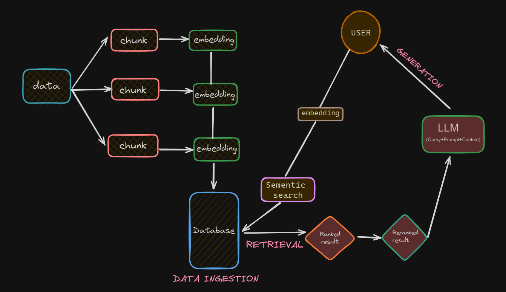
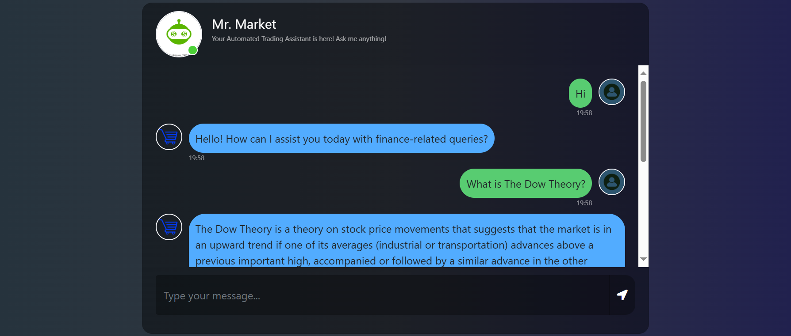

## Mr. Market: LLMOps TradingBot Built with RAG Architecture

### Project Architecture 

### Problem Statement
Individual investors and finance enthusiasts often struggle to navigate the complexities of the financial markets. They face challenges in accessing accurate, up-to-date, and comprehensive financial information. This lack of readily available knowledge, coupled with limited time, resources, or expertise, can hinder their ability to make informed investment decisions.

### Project Summary

Mr. Market is a chatbot designed to assist individual investors with their financial questions. It delivers expert financial advice and answers user queries with precision and relevance. 

The chatbot leverages machine learning and artificial intelligence, particularly advanced natural language processing (NLP) models and a robust database, to ensure high-quality information retrieval and generation. It achieves this by:
    1. Accessing and processing financial data
    2. Answering user queries in a comprehensive and informative way
    3. Providing relevant and concise financial advice

The project involves ingesting financial documents, transforming this data into a searchable format, and deploying an interactive web interface where users can engage with the chatbot. By integrating OpenAI's powerful embeddings and leveraging AstraDB for efficient data storage and retrieval, Mr. Market offers a seamless and insightful financial advisory experience.

### Tech Stack
##### Programming Languages:
* Python

##### Libraries and Frameworks:
* Langchain: For building language models and chain operations.
* Langchain-openai: For integrating OpenAI embeddings.
* Langchain-astradb: For managing vector storage in AstraDB.
* Flask: For creating the web server and handling HTTP requests.
* Pandas: For data manipulation and analysis.

##### Data Processing:
* PyPDFLoader: For loading and parsing PDF documents.
* RecursiveCharacterTextSplitter: For splitting large texts into manageable chunks.

##### Environment Management:
* Python-dotenv: For loading environment variables from a .env file.

##### Deployment:
* Flask: For the web application framework to serve the chatbot interface.

##### Front-end:
* HTML/CSS: For structuring and styling the chatbot interface (chat.html and style.css).

##### Database:
* AstraDB: For storing and retrieving vector embeddings of the documents.